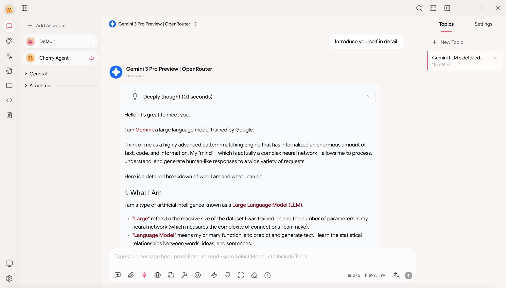
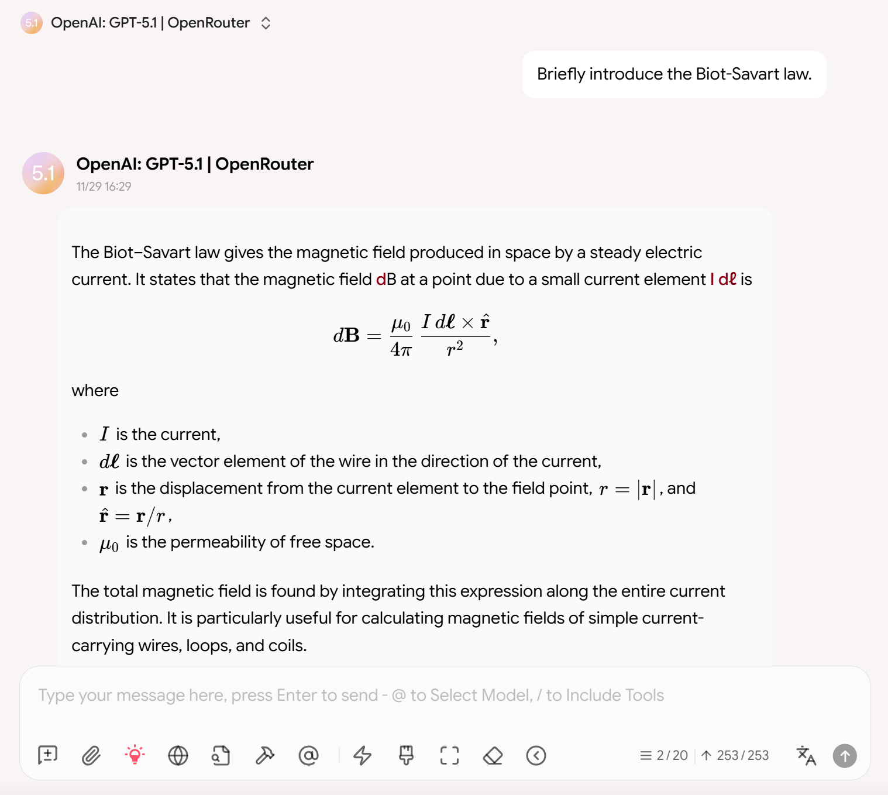
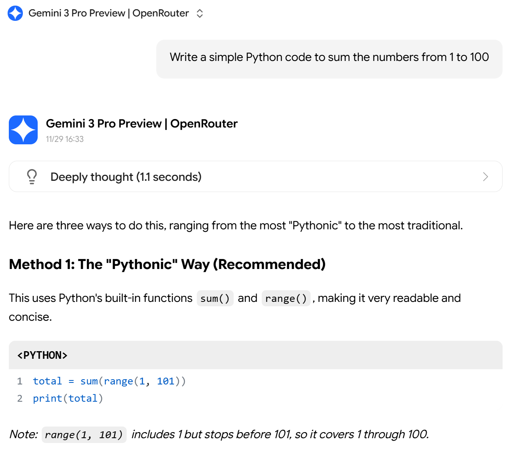
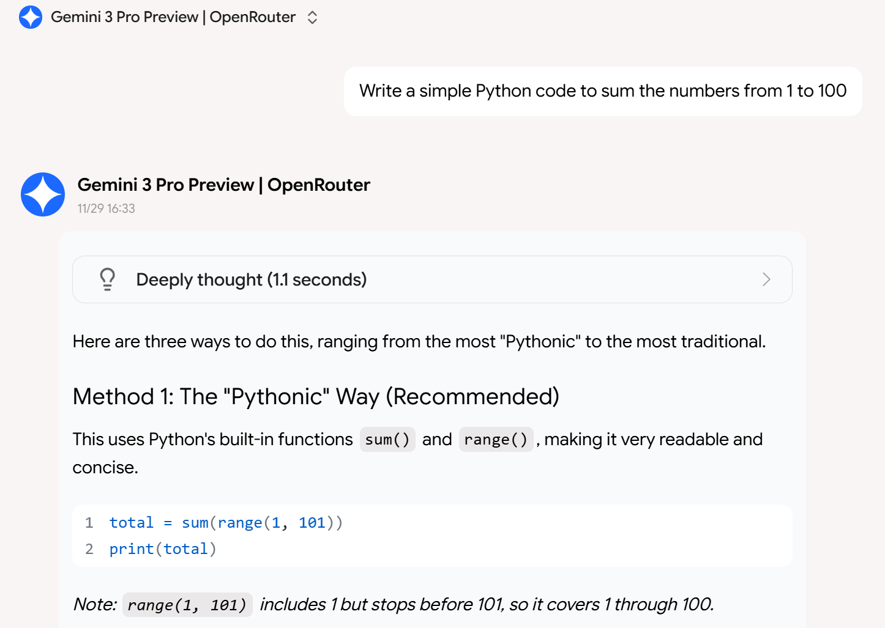
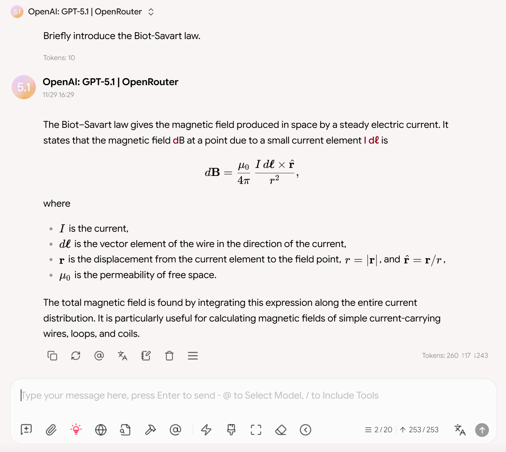

# Cherry Studio Theme: Numina

A beautiful, modern, and detail-oriented [Cherry Studio](https://github.com/CherryHQ/cherry-studio) user interface theme based on the [CherryStudio-Aero](https://github.com/hakadao/CherryStudio-Aero). **Both the default theme and Aero theme are great! Many of the detailed modifications are just due to my personal preference.**

## Overview

This is a general preview of the theme's effect.

### Rounded Avatars and More Beautiful Chat Bubble Display

- All user and assistant avatars use circles instead of rounded squares.
- Make the message bubbles in **Bubble** Message Style more beautiful.

### Optimized Code Block Display

This is the default code block display:

Here, `CodeHeader` is hidden to maintain simplicity.

### Optimized Visual Symmetry for Plain Message Style

Increase the right margin of markdown text to maintain the symmetry of the text layout.

### Other Detail Modifications

The rendering of markdown has been optimized, such as spacing, font weight, etc. There are also some other minor modifications, see [theme.css](theme.css) for details.

## Quick Start

Copy the content of [theme.css](theme.css) to the custom CSS setting of Cherry Studio.

## License

This project is licensed under the AGPLv3 License.